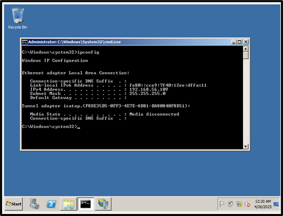
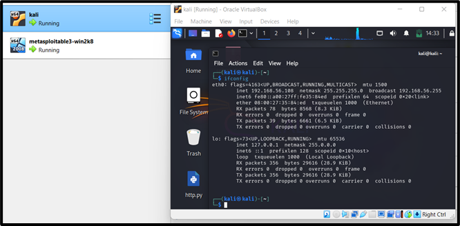
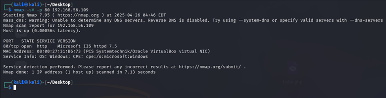
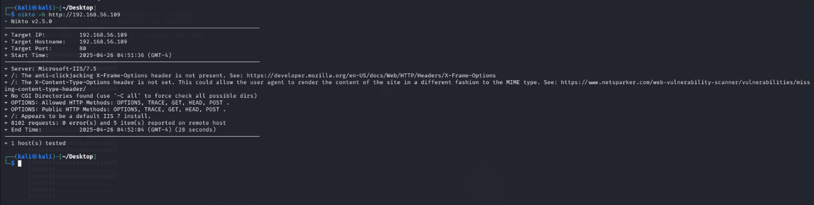
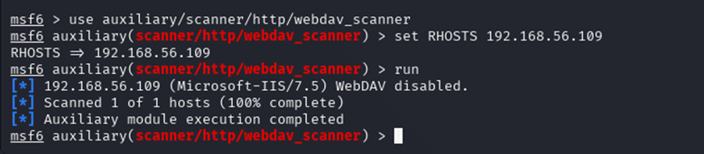
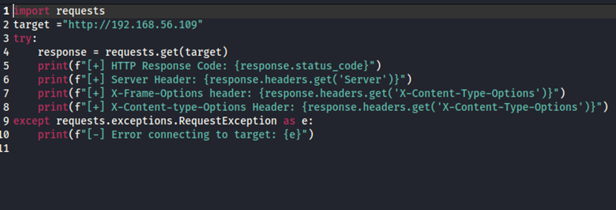
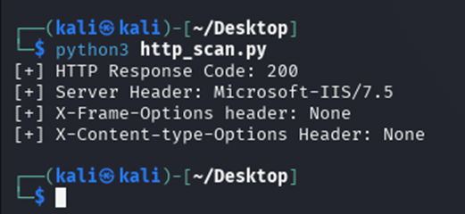

# Phase 1: Service Setup and Compromise

This phase involved configuring both attacker and victim machines in a vulnerable network environment, identifying a weak service, and executing both standard and custom attacks. Screenshots and scripts were used to document key steps.

---

## Victim Machine Setup (Metasploitable3 - Windows Server 2008 R2)

Metasploitable3 was chosen as the intentionally vulnerable victim machine. The setup was completed using:

- **Vagrant**: Automated provisioning
- **VirtualBox**: Running the VM
- **OS**: Windows Server 2008 R2

Steps included:
- Cloning the Metasploitable3 repo
- Installing dependencies (e.g., Packer, Vagrant plugins)
- Running build scripts
- Connecting both attacker and victim to the same internal network

---

## Attacker Machine Setup (Kali Linux 2024)

Kali Linux 2024 was used as the attacker machine due to its built-in tools:

- Nmap
- Nikto
- Metasploit Framework

It was installed and configured in VirtualBox on the same internal network as the victim to enable full network communication and analysis.

---

## Service Selected for Attack: HTTP (Microsoft IIS 7.5)

The HTTP service running on port **80** was selected as the attack target. This was discovered through:

- `Nmap` Service Detection: Identified Microsoft-IIS/7.5
- `Nikto` Web Scan: Revealed missing security headers and default pages

This made the web server a high-value target due to:
- Known vulnerabilities
- Common misconfigurations
- Exposed default settings

---

## Vulnerability Discovery

### Nmap Results:
- Port 80 open
- Detected service: Microsoft-IIS/7.5

### Nikto Results:
- Missing `X-Frame-Options`, `X-Content-Type-Options`
- Default IIS pages present
- Permissive HTTP methods (OPTIONS, TRACE, etc.)

---

## Attack Execution using Metasploit

### Module Used:
auxiliary/scanner/http/webdav_scanner

### Commands:
use auxiliary/scanner/http/webdav_scanner set RHOSTS 192.168.56.109 run

**Result**: Service detected successfully, but WebDAV was disabled — no further exploitation via this vector.

---

## Custom Script Attack – Python

A Python 3 script was written using the `requests` library to manually query the HTTP service and extract headers.

### Script File: [`http_scan.py`](./http_scan.py)

### Script Objective:
- Connect to the HTTP server
- Retrieve HTTP headers
- Identify missing security headers

### Output:
- `Status Code`: 200 OK
- `Server`: Microsoft-IIS/7.5
- `X-Frame-Options`: **Missing**
- `X-Content-Type-Options`: **Missing**

This confirmed that the server was vulnerable to:
- **Clickjacking**
- **MIME Sniffing Attacks**

---

## Summary

Phase 1 successfully identified a misconfigured and vulnerable HTTP service, attempted exploitation using Metasploit, and confirmed weaknesses via a custom script. These findings were later used to inform SIEM analysis and defensive strategies in Phases 2 and 3.
