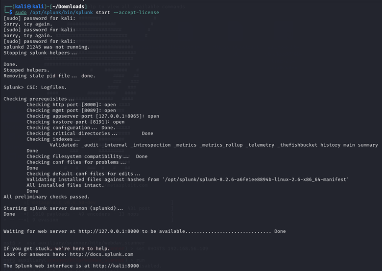
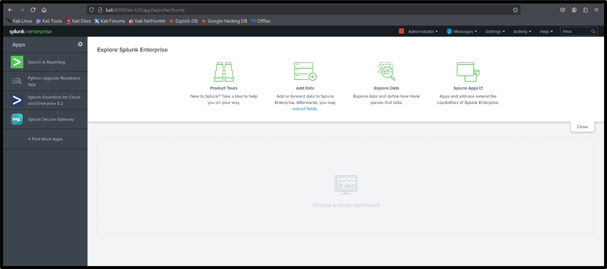
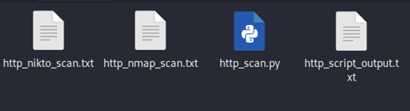
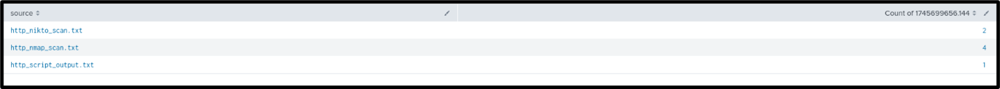
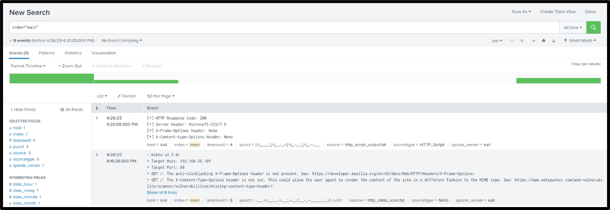
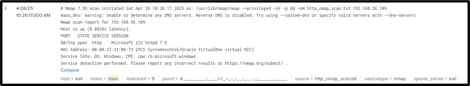
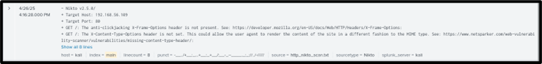
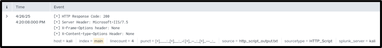
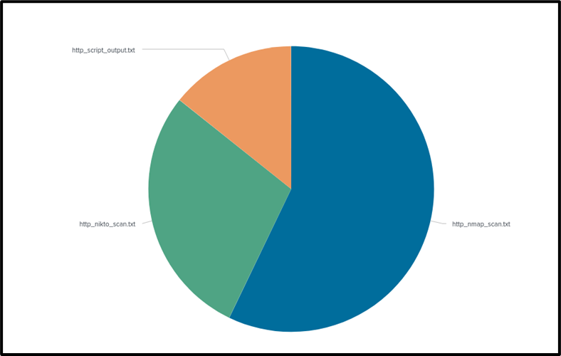
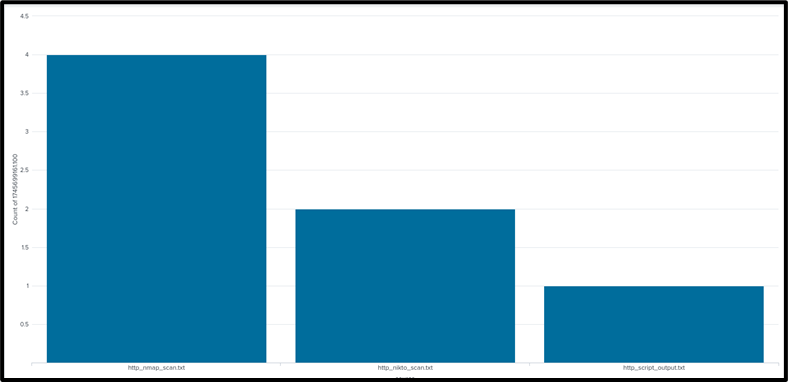

# Phase 2: SIEM (Splunk) Attack Log Analysis and Visualization

After compromising the HTTP service in Phase 1, the next step was to analyze and visualize the attack data using a Security Information and Event Management (SIEM) platform. Splunk was selected for this task due to its strong capabilities in log indexing, searching, and dashboard creation.

---

## Splunk Setup and Installation

Splunk was installed directly on the attacker machine (Kali Linux 2024) to serve as the central log analysis platform.

### Installation Steps:

1. Download Splunk from the official site:
   - File: splunk-8.2.6-a6fe1ee8894b-linux-2.6-amd64.deb

2. Install the .deb package using:
   sudo dpkg -i splunk-8.2.6-a6fe1ee8894b-linux-2.6-amd64.deb

3. Start Splunk:
   sudo /opt/splunk/bin/splunk start --accept-license

4. Access the Splunk Web Interface at:
   https://localhost:8000

---

## Attack Data Collection

Three different tools were used against the victim machine (Metasploitable3) to generate logs:

### 1. Nmap Scan
Command:
nmap -sV -p 80 192.168.56.109 -oN http_nmap_scan.txt

### 2. Nikto Web Server Vulnerability Scan
Command:
nikto -h http://192.168.56.109 -o http_nikto_scan.txt

### 3. Custom Python HTTP Banner Script
Command:
python3 http_script.py > http_custom_scan.txt

---

## Data Ingestion into Splunk

The three log files were uploaded using Splunk's "Add Data" feature:
- http_nmap_scan.txt
- http_nikto_scan.txt
- http_custom_scan.txt

Each file was uploaded with source type: Automatic detection, and assigned to index: main.

---

## Searching Attack Events

To verify ingestion, a search was run using the query:
index="main"

This returned results from all three sources:
- Nmap scan
- Nikto scan
- Custom Python script

---

## Dashboard Creation and Visualization

A dashboard titled "HTTP Attack Dashboard" was created in Splunk with the following panels:

### Pie Chart Panel
Visual representation of the number of events generated by each scan source.

### Bar Chart Panel
Bar chart comparing total entries from each scan log file.

### Single Value Panel
Displays the total number of attack-related events parsed.

---

## Summary

In this phase, attack data was successfully generated using multiple tools, ingested into Splunk, and visualized using a custom dashboard. This process highlighted how SIEM platforms can transform raw log data into meaningful insights for monitoring, threat detection, and analysis.
