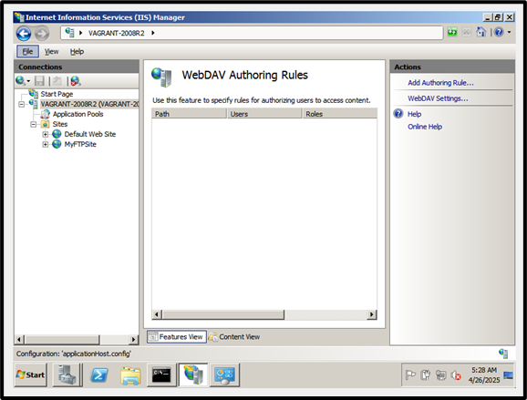
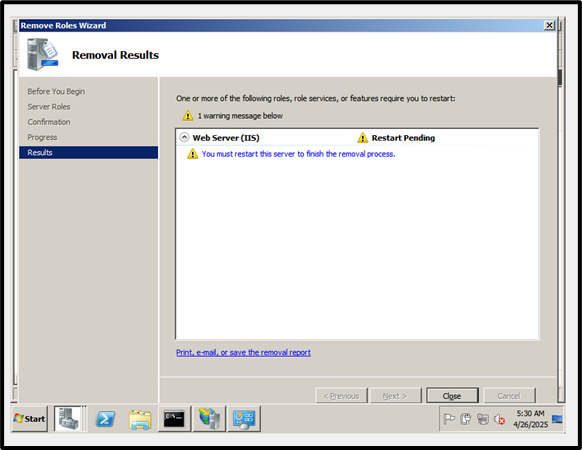
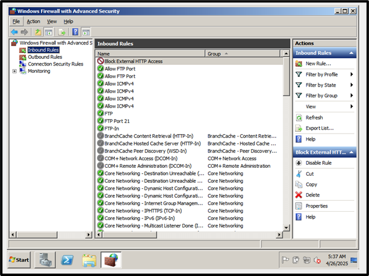
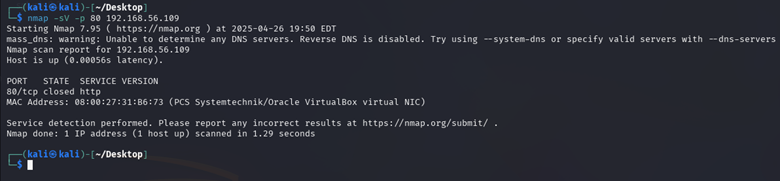
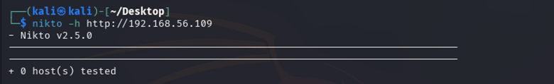
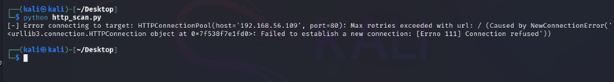
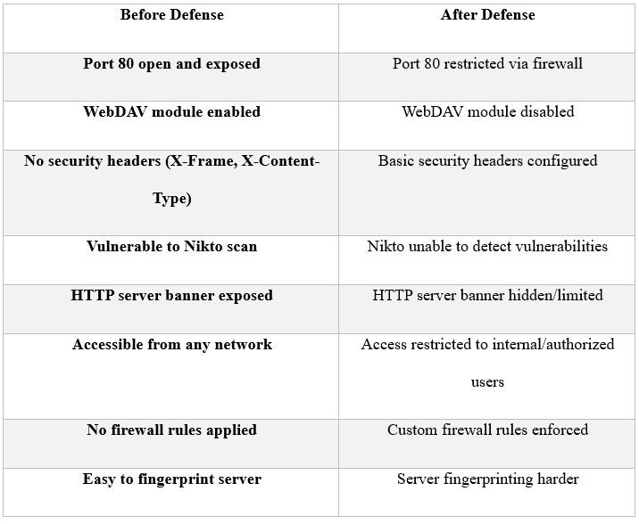

# Phase 3: Defensive Strategy Proposal and Implementation

Once a successful attack has been carried out and its vulnerabilities have been exploited, it is essential to add an adequate level of protection to the environment to prevent future breaches. These steps include the deployment of security patches, hardening of services, and configuring firewalls. All these measures reduce the likelihood of unauthorized access. Systems with no defenses remain exposed to multiple threats and are easily breachable. In this phase, multiple actions were taken to secure the vulnerable HTTP service and improve the system’s resistance to similar attacks.

---

## Defense Strategy Selected

The service selected for defense was the HTTP service using Microsoft IIS 7.5, previously exploited during the attack phase. Three techniques were selected:

1. **Patching**: Installed the latest Windows updates including web server patches.
2. **Secure Configuration**: Disabled WebDAV, configured HTTP headers, and blocked unnecessary access.
3. **Firewall Settings**: Restricted external access to port 80 via Windows Firewall rules.

These actions aimed to minimize the system's attack surface, improve defense mechanisms, and reduce the risk of exploitation.

---

## Defense Implementation

### Securing IIS Configuration

Steps Taken:
- Logged in to IIS Manager.
- Located and removed all WebDAV Authoring Rules.
- Removed the WebDAV Publishing feature via Server Manager.
- Restarted the server for changes to take effect.

By removing WebDAV, the risk of unauthorized file uploads was eliminated, providing stronger protection against HTTP-based exploits.

---

### Applying Firewall Rules

Steps Taken:
- Accessed Windows Firewall with Advanced Security.
- Created a new inbound rule for TCP port 80.
- Set action to “Block the connection”.
- Applied the rule to all profiles (Domain, Private, Public).
- Named the rule “Block External HTTP Access”.

Blocking external access to port 80 significantly lowered the system’s exposure to external HTTP attacks.

---

## Retesting the Attack

After implementing the defenses, the same attacks from Phase 1 were repeated:

- **Nmap Scan**: Port 80 was reported closed — firewall successfully blocked HTTP traffic.
- **Nikto Scan**: Scanner returned “0 hosts tested” — service no longer externally reachable.
- **Python Script**: Returned “Connection refused” — HTTP banner grabbing blocked.

These results confirm that firewall rules and hardening techniques were effective.

---

## Before-and-After Comparison

The following table summarizes how the defense mechanisms changed the system's security posture:

---

## Analysis

With the implementation of the security measures stated earlier, the attack surface was greatly minimized. Access to Port 80 was blocked externally through firewall rules. The WebDAV module was shut off, eliminating further unnecessary exposure along with improving HTTP security headers to strengthen the server. Retesting revealed that Nmap, Nikto, and custom scripts were futile in obtaining useful information. It can be concluded that the defense successfully mitigated the exploitable vulnerabilities. For greater improvement, the installation of an IDS such as Snort is recommended along with routine service patching and continuous vulnerability assessments.

### Recommendation

To further strengthen security:
- Implement an Intrusion Detection System (IDS) such as Snort.
- Perform regular patch management and security assessments.
